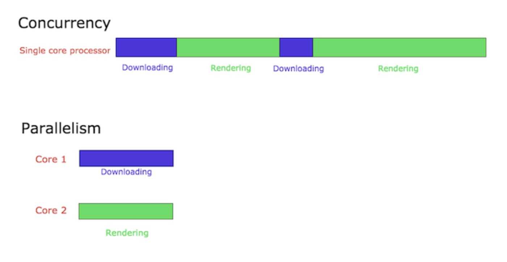

# Concurrency in Go

Go là ngôn ngữ concurrent (đồng thời) không phải parallel(song song)

### 1. Concurrency là gì ?

Concurrency (đồng thời) là cách `chia 1 tiến trình lớn thành nhiều phần độc lập` có thể chạy `song song hoặc xen kẽ nhau`.

> Vấn đề chính là `làm thế nào để các phần này chia sẻ data 1 cách an toàn (tránh xung đột, race condition)`

- `Concurrency là làm nhiều việc cùng 1 lúc`
- Ex: Hãy xem xét một người đang chạy bộ. Trong lúc chạy bộ buổi sáng, giả sử dây giày của anh ấy bị tuột. Bây giờ người đó ngừng chạy, buộc dây giày rồi lại bắt đầu chạy. `Người có khả năng vừa chạy vừa buộc dây giày, tức` là người có thể giải quyết nhiều việc cùng một lúc :))

### 2. Đa số ngôn ngữ làm thế nào?

- Dùng OS - levels threads
- Shared memory - chia sẽ vùng nhớ
- Để tránh xung đột dùng: locks, mutex or semaphore

=> Cách làm này có thể gây deadlock, race condition và khó debug.

### 3. Go thì khác:

- Go sử dụng mô hình SP (Communicationg Sequential Process):
  - Đề xuất bởi Tony Hoare (cha đẻ thuật toán Quicksort) năm 1978
  - CSP: các tiến trình `không chia sẻ data trực tiếp`, mà `giao tiếp thông qua channels`
  - `Don't share memory, communicate instead`.

### When to Use Concurrency

> Đừng lạm dụng concurrency: Cái gì cũng ném vào go routine rất dễ dẫn đến deadlock, race condition, code khó maintain.

### `What is parallelism and how is it different from concurrency?`

- Concurrency: Cấu trúc chương trình để `xử lý nhiều việc cùng lúc, dù có thể không chạy đồng thời`
- Parallelism: Thực sự chạy nhiều thứ cùng lúc `trên nhiều CPU core`

> Việc code đồng thời có chạy Parallelism hay không (cùng một lúc) phụ thuộc vào phần cứng và nếu thuật toán trong OS cho phép.

- `Sự song song đang làm nhiều việc cùng một lúc. Nghe có vẻ giống với đồng thời nhưng thực tế nó khác.`
- Ex: Hãy hiểu nó rõ hơn với ví dụ chạy bộ tương tự. Trong trường hợp này, giả sử rằng người đó đang chạy bộ và cũng đang nghe nhạc trên iPod của mình. Trong trường hợp này, `một người đang chạy bộ và nghe nhạc cùng một lúc`, tức là anh ta đang làm nhiều việc cùng một lúc. Điều này được gọi là sự song song.

### `Concurrency and Parallelism - A technical point of view`

Giả sử chúng ta đang lập trình một trình duyệt web. Trình duyệt web có nhiều thành phần khác nhau. Hai trong số đó là khu vực hiển thị trang web và trình tải xuống để tải xuống các tệp từ internet. Giả sử rằng chúng ta đã cấu trúc mã trình duyệt theo cách mà mỗi thành phần này có thể được thực thi độc lập (Điều này được thực hiện bằng cách sử dụng các luồng trong các ngôn ngữ như Java và trong Go, chúng ta có thể đạt được điều này bằng cách sử dụng Goroutines , sẽ nói thêm về điều này sau).

    - Khi trình duyệt này được chạy trong bộ xử lý lõi đơn, bộ xử lý sẽ chuyển đổi ngữ cảnh giữa hai thành phần của trình duyệt. Nó có thể tải xuống một tệp trong một thời gian và sau đó nó có thể chuyển sang hiển thị html của trang web mà người dùng yêu cầu. Điều này được gọi là đồng thời. Các quy trình đồng thời bắt đầu tại các thời điểm khác nhau và chu kỳ thực hiện của chúng chồng chéo lên nhau. Trong trường hợp này, quá trình tải xuống và kết xuất bắt đầu ở các thời điểm khác nhau và quá trình thực thi của chúng trùng lặp.

    - Giả sử cùng một trình duyệt đang chạy trên bộ xử lý đa lõi. Trong trường hợp này, thành phần tải xuống tệp và thành phần kết xuất HTML có thể chạy đồng thời trong các lõi khác nhau. Điều này được gọi là sự song song.

`Tính song song không phải lúc nào cũng mang lại thời gian thực hiện nhanh hơn. Điều này là do các thành phần chạy song song có thể phải giao tiếp với nhau.`

Ví dụ: trong trường hợp trình duyệt của chúng tôi, khi quá trình tải xuống tệp hoàn tất, điều này sẽ được thông báo tới người dùng, chẳng hạn như sử dụng cửa sổ bật lên. Giao tiếp này xảy ra giữa thành phần chịu trách nhiệm tải xuống và thành phần chịu trách nhiệm hiển thị giao diện người dùng. Chi phí liên lạc này thấp trong các hệ thống đồng thời. Trong trường hợp các thành phần chạy song song trong nhiều lõi, chi phí giao tiếp này sẽ cao. Do đó, các chương trình song song không phải lúc nào cũng mang lại thời gian thực hiện nhanh hơn!

### All programs follow: input -> transform -> output.

Xét từng bước: - Nếu các bước `phụ thuộc nhau` (step 2 cần kết quả step 1) -> `Không nên concurrent` - Nếu có thể `chạy độc lập`(song song tải data từ nhiều nơi) -> `nên sử dụng concurrency`

### Chỉ nên dùng concurrency khi task mất rất nhiều time

Nếu đang chạy 1 func tính toán nhanh trong RAM - nặng về `CPU bound` -> `Dùng goroutine có thể làm chậm hơn` vì: - Tốn chi phí tạo goroutine - Tốn chi phí truyền data qua channel.

> Conncurrency `thực hiện hiệu quả khi xử lý I/O` (network, file, http call) vì những thứ đó `chậm hơn nhiều lần so với RAM`.

## `Goroutine`

### Process, Thread, CPU

- Process: 1 chương trình đang chạy. OS cấp phát bộ nhớ và cô lập nó khỏi các process khác.
- Thread: Đơn vị thực thi trong 1 process. Nhiều thread có thể chia sẻ tài nguyên của cùng 1 process.
- CPU core: 1 core có thể xử lý 1 or nhiều thread cùng 1 lúc

> OS có `scheduler` để phân chia time CPU cho các thread.
