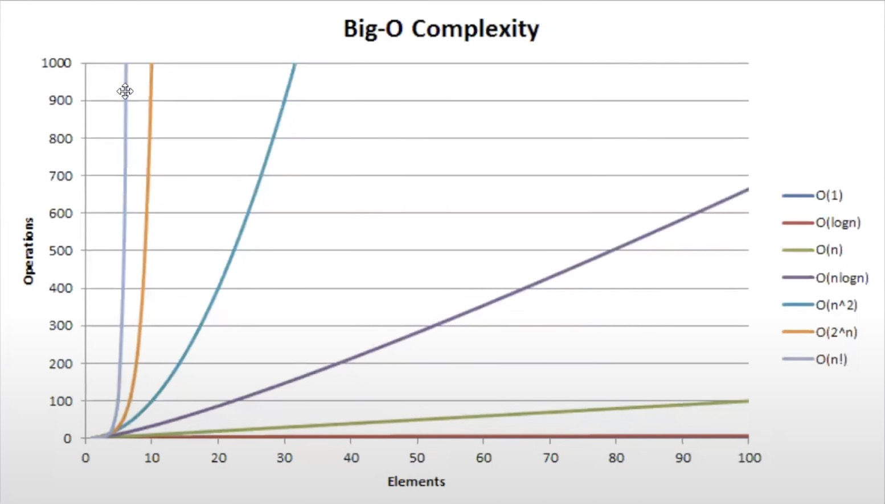
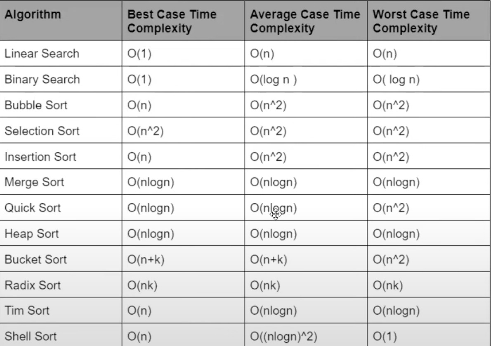

# DSA

> - Tập debug,run code bằng mắt, đầu trước, chắc chắn mới submit
>
> - 1 topic nên làm nhiều đến mức thành thạo rồi mới chuyển sang topic khác
>
> - Nên tổng hợp các template, best practice để khi gặp dạng bài là lôi template ra áp dụng luôn đỡ phải nghĩ nhiều

## 1.1: Time complexity

Dùng so sánh thuật toán này của mình là nhanh hay chậm.

## 1.2: Space complexity

Dùng so sánh thuật toán này của mình dùng tốn ít hay nhiều bộ nhớ.

# Link bài tập làm thêm

https://github.com/yuvrajverma01/Data-Structures-And-Algorithms-Roadmap
