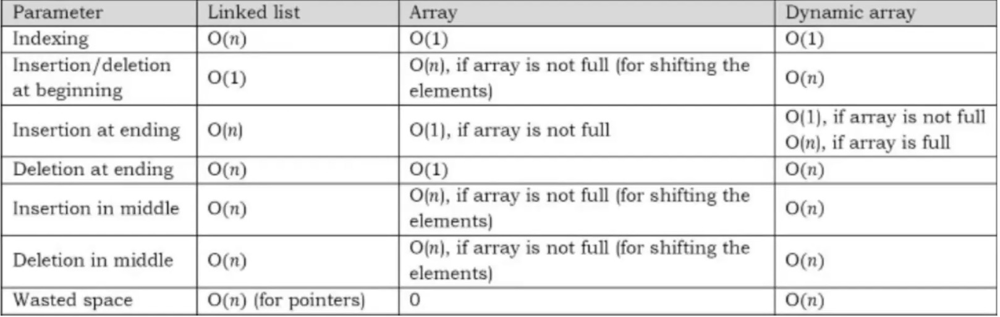

Array include:

- Static array
  - Fixed size array
  - Allocated trong memory tại compile time
- Dynamic array
  - resizeable array
  - Allocated tron memory tại run time
  - Khi mà array dynamic gần đầy → nó sẽ allocate 1 array mới có kích thước lớn hơn thường là gấp đôi sau đó copy array cũ vào array mới, tương tự với khi delete thì nó sẽ được opy sang array nhỏ hơn
  - Located in heap memory space normally, heap size có thể request tăng lên
  - Python: list - python chỉ có mảng động

Đặc điểm:

- data trong mảng được lưu trữ liên tiếp nhau trên memory
- random access: O(1)
- thêm và xóa phần tử ở `cuối` mảng (chỉ mảng động): `O(1)`
- thêm và xóa 1 phần tử `bất kì` trong mảng: `O(n)`



### Advanced

- kadane's algorithm
- sliding window fixed size
- sliding window variable size
- two pointers
- prefix sums

### Prefix Sum: Hay sử dụng trong các bài sub array

```
Problem: Cho array A và q queries:
  query(i,j) => return sum(A[i] + A[i+1] + ... + A[j])

Prefix Sum solution:
  prefix[i] = A[0] + A[1] + ... + A[j]
  query(i,j) = prefix[j] - prefix[i - 1]

time: O(p+q)
```

```
n = length of nums
tinh truoc tat cac tong cua nums[0: i] voi i chay tu 0 -> n - 1
va chua trong 1 array do dai n + 1: pool
-> sum(nums[left: right + 1]) -> pool[right + 1] - pool[left]
```

> Cho 1 array A of interger
>
> prefix[i] = sum(A[0],...,A[i])

A = [1, 3, 5, 7, 9]
-> prefix = [1, 4, 9, 16, 25]

```
sum = 0
for(i:A)
  sum += A[i]
  prefix.append(sum)
```
